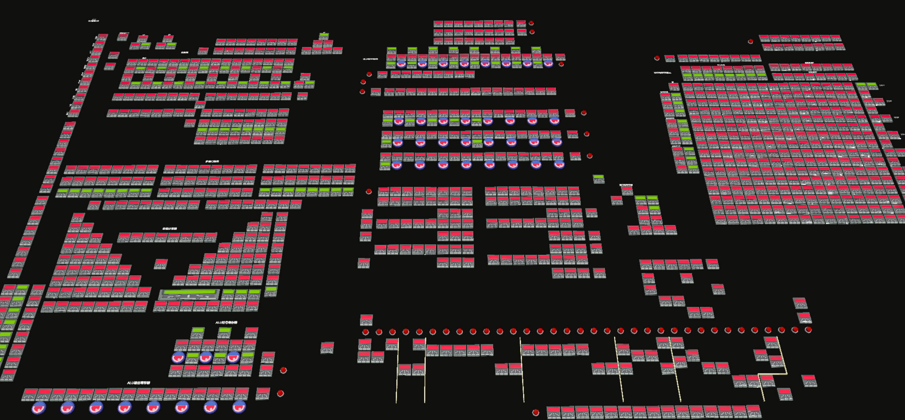

# DZC-8M Plus 处理器工具链

## 概述

DZC-8M Plus 是一款在《[蛋仔派对](https://party.163.com)》中完全使用逻辑门搭建实现的 **8 位处理器**。

该处理器基于早期 **DZC-8M** 架构改进而来，在保持原有设计思路的同时，增强了指令支持与运行稳定性。

## 主要特性

- **位宽/字长**：8 bit  
- **指令集类型**：精简 CISC  
- **支持指令**：
  - 运算：条件赋值，无进位/带进位 加/减，逻辑运算（非/与/或/异或）
  - 移位：左移 / 右移
  - 控制：支持通过修改 PC 寄存器实现跳转

## 工具链说明

- `cp.py`：汇编编译器，用于将汇编代码编译为机器码。
- `vm.py`：虚拟机，支持在本地模拟处理器执行过程。

详见[开发手册](docs/开发手册.md)

## 体验方式

可在《[蛋仔派对](https://party.163.com)》中访问玩家 ID **`0224315086`** 的庄园进行体验。  
当前版本为测试阶段，使用时请注意以下事项：

### ROM 输入与执行

1. ROM 需从地址 `0x0` 开始写入。
2. 程序执行结束后如需重新运行，请先将 `PC` 寄存器清零。

### 程序停止与调试

3. **请勿使用“停止”按钮终止程序**（当前版本未保存上下文状态），应使用“单步调试”安全停止。  
   若使用“暂停”，之后必须点击“启动”以恢复执行。

### 时钟控制

4. “启动(调试)”会启用 1Hz 的低频时钟。可与“启动”配合使用，但需注意：
   - 两个时钟不可同时启用
   - 启用另一时钟前，当前时钟状态必须为 **0**，否则可能导致时序冲突
