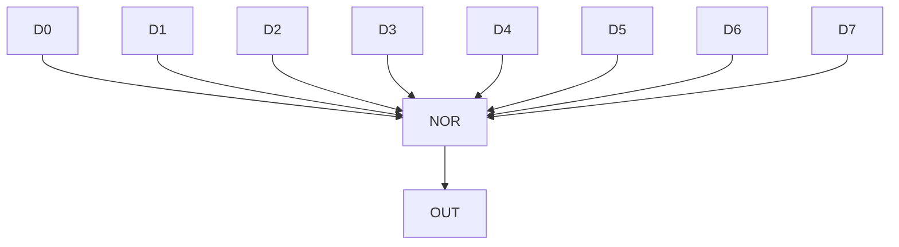
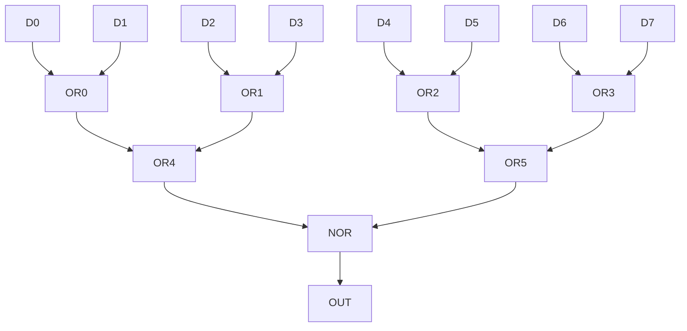

# 遇到的小困难

在制作DZC-8M以及DZC-8M Plus处理器时，遇到了一些小困难，记录如下，供大家学习。

下面使用逻辑门表示“逻辑开关”组件。

## [不是重点]组件占用值上限

蛋仔派对中，庄园的组件占用值上限为20000-25000。

一个逻辑开关的占用值为10。

占用值上限看起来挺大，实际上，随着逻辑门的增多，它比想象中的小，使电路不得不尽量简化。

## [重点]逻辑门底层机制与长逻辑链失效分析

在蛋仔派对中，逻辑门的底层实现基于事件驱动的收发机制：

- 仅当逻辑门输出状态发生变化（从`0`变为`1`，或从`1`变为`0`）时，才会触发并发送一个事件。
- 若输入发生变化但输出保持不变，则不会产生任何事件。

~~sm的冈易脑子抽了把游戏改成这样~~存在以下关键限制：

1. **事件队列长度限制**  
    游戏内事件队列的容量被设定为约256个事件，容量较为有限。

2. **事件处理机制**  
    每个事件必须在其对应的处理单元（如下一级逻辑门）执行完成后，才会从队列中移除。推测此设计是由于未实现参数复制机制，导致事件必须在处理完毕后才能释放。

3. **长逻辑链问题**  
    因1.2., 当逻辑链过长时，连续产生的事件数量极易超过队列容量限制。一旦超出上限，后续事件将被系统直接丢弃，从而导致逻辑执行中断或失效。

DZC-8M架构就是因此产生一些概率性怪异问题（如PC寄存器跳变、写失效等）。

同理，在设计单周期乘法器时，也遇到了类似问题，导致乘法器有概率无法正常工作。

DZC-8M Plus处理器则针对此问题进行优化：

1. **分周期处理**  
    对于可能导致长逻辑链的步骤，拆分成多个周期处理，避免事件数量超过队列上限。

2. **特定功能使用独立电路**  
    对于一些特定模块的操作（例如，ALU对AF的覆盖，PC寄存器的更新），使用独立电路，避免事件链过长以及不可靠问题。  

3. **电路技巧**  
    用技巧性的电路设计来避免长逻辑链。下面会详细说明。

## 电路技巧

对于ZF的识别，传统的方式如下：

一旦任意一个`D`状态发生变化，就会对`NOR`发生一个事件，即便输出的结果可能没有变化。实测发现，这在某些情况下会导致ZF失效。

改进如下：

这样，对于每一级的事件，都会以最高的效率对无效事件进行过滤，从而减少ZF失效的概率。
